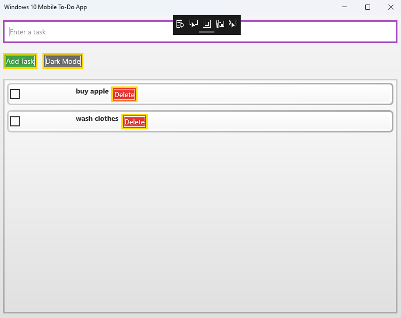
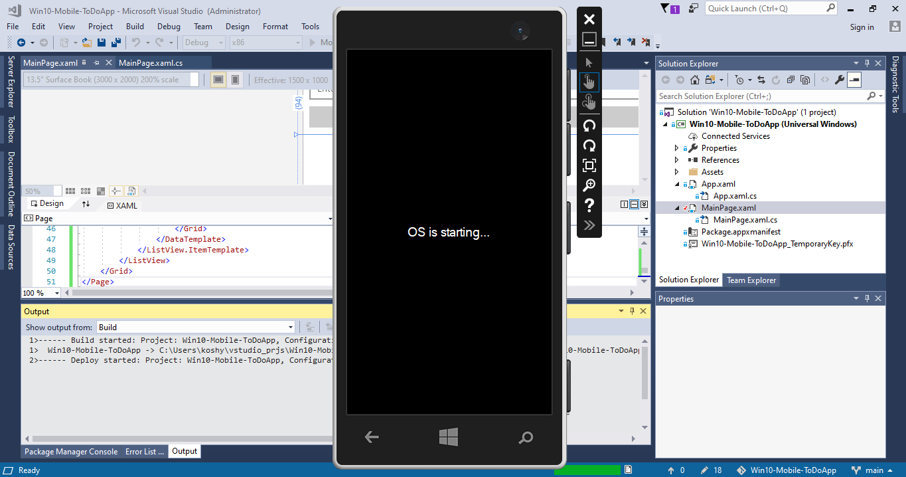
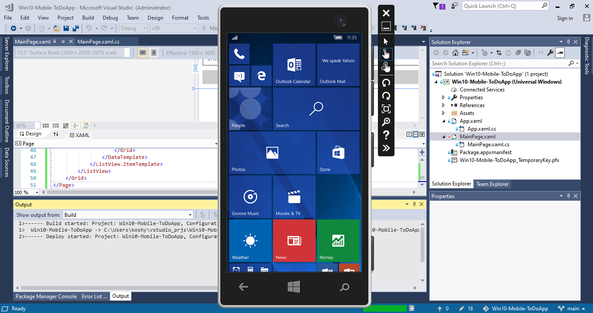
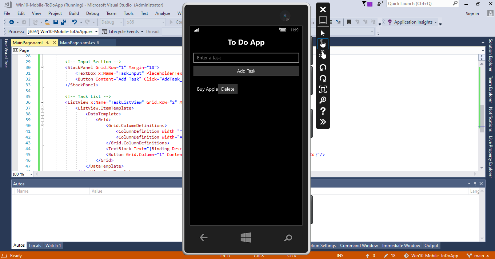

Windows 10 Mobile To-Do App
A simple To-Do application built for Windows 10 Mobile using the Universal Windows Platform (UWP). This app allows users to add tasks, mark them as completed, and delete them, with a responsive UI optimized for mobile devices.
Features

Add new tasks via a text input.
Mark tasks as completed using checkboxes.
Delete tasks with a button.
Adaptive design for Windows 10 Mobile screens.

Screenshots

Requirements

Windows 10 Mobile (build 10.0.10240 or later).
Visual Studio Community 2017 with the Universal Windows Platform development workload.
Windows 10 SDK (version 10.0.10240 or later).

Setup

Clone the repository.
Open the solution (Win10-Mobile-ToDoApp.sln) in Visual Studio Community 2017.
Build the solution (Ctrl+Shift+B).
Deploy to a Windows 10 Mobile device (with Developer Mode enabled) or emulator.
Select ARM for devices or x86 for emulators.
Run with F5.

Project Structure

ToDoPage.xaml: Defines the UI (text input, add button, task list).
ToDoPage.xaml.cs: Handles task addition, completion, and deletion.
Package.appxmanifest: Configures the app’s display name and platform settings.

Usage

Enter a task in the text box and click Add Task.
Check a task’s checkbox to mark it as completed.
Click Delete to remove a task.

License
MIT License
